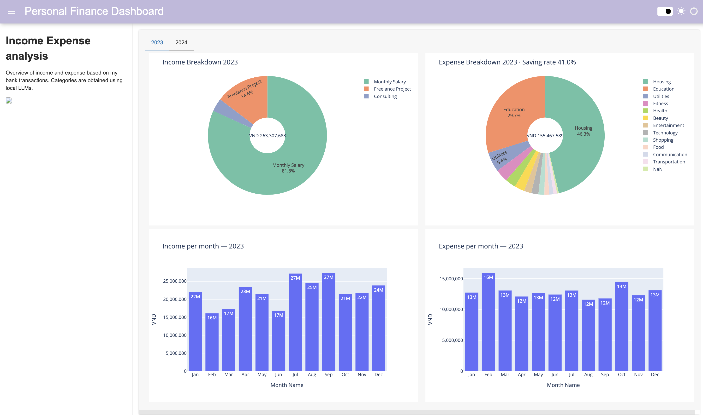

# Llms-analyse-finance (Personal Transactions)

In this project, I explore how local LLMs / Python notebooks can be used to **label/categorize bank transactions** and build a small **personal finance dashboard** for 2023–2024.

---

## Installing local LLMs (optional)
- Ollama: https://ollama.ai/  

## Personal finance dashboard
 
---

## Data schema (CSV)
- `Date` — `YYYY-MM-DD`
- `Name / Description`
- `Expense/Income` — `Expense` or `Income`
- `Amount (VND)` —  `6.000.000 VND`

---

## Disclaimer:
The example data in this repo are fictious and for illustration purposes.
