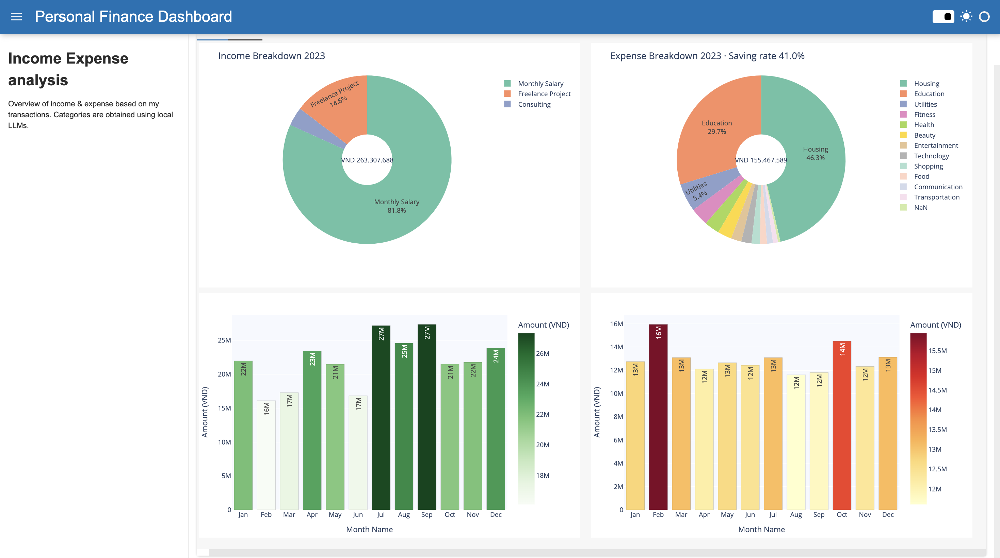

# LLMS-analyse-finance (Personal Transactions)

- An end to end example of applying **local LLMs in Python** to transaction categorization and dashboarding—delivering an **interactive personal-finance view (2023–2024)**.
---

## Final Outcomes: Personal finance dashboard

[![Open the Personal Finance Dashboard]

## Step_1 Installing local LLMs (optional)
- Ollama: https://ollama.ai/  

## MORE DETAIL PLS STEP_2 & STEP_3 & STEP_4

## Data schema (CSV) NEED TO PREPARE
- `Date` — `YYYY-MM-DD`
- `Name / Description`
- `Expense/Income` — `Expense` or `Income`
- `Amount (VND)` —  `6.000.000`

---

## Disclaimer:
The example data in this repo are fictious and for illustration purposes.

## PURPOSE: 1. EASY TO SHARE AND MODIFY | 2. STORAGE PROJECT | 3.SHARE TOKEN ##4. PROFRESSIONAL PROJECT

## GTI COMMAND: git add . > git commit -m "MESSAGE" > git push 

